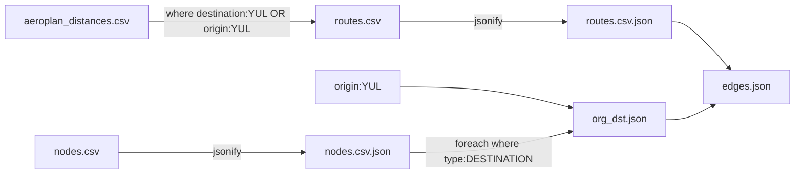

# ac-fp
Flightpass data for visualization and etc

Expected workflow
1. destinations are pulled manually (for now) for a flight pass
2. destinations are processed into json for later use as combined object
3. route csv is from cowtool (for now?) csv
4. routes with YUL as origin/destination are filtered out
5. route csv is converted to json for merge
6. route json is combined with nodes json to form nodes and edges json
7. nodes and edges used in eg grafana?